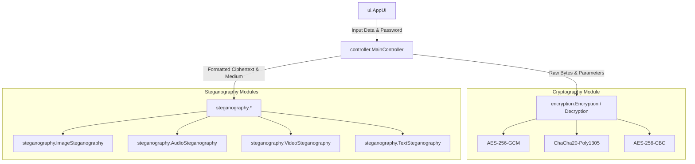
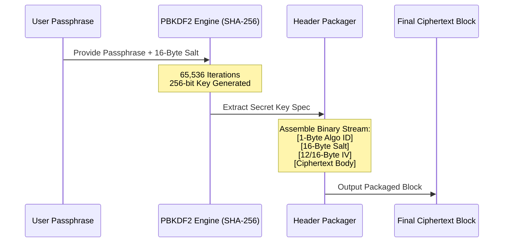
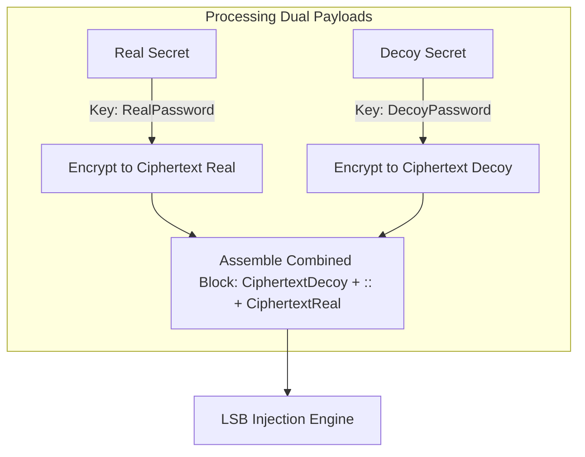
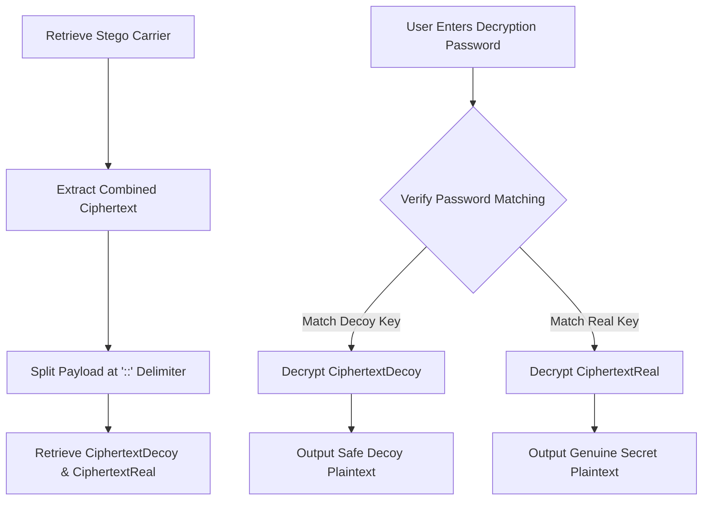

# Cryptography and Steganography Project

This repository contains the OOPS Cryptography and Steganography Project, a Java-based security software suite that integrates cryptographically secure encryption engines with multi-format steganography insertion mechanisms. The application provides file-based and message-based security over various medium carriers—including images, audio waves, video containers, and raw text files—complemented by a responsive, themed Swing graphical user interface and a comprehensive automated system test suite.

---

## Table of Contents
1. [Architecture Overview](#architecture-overview)
2. [Subsystem Specifications](#subsystem-specifications)
3. [Cryptographic Design](#cryptographic-design)
4. [Steganographic Embedding Logic](#steganographic-embedding-logic)
5. [Decoy Layer Protocol](#decoy-layer-protocol)
6. [Mathematical Foundations](#mathematical-foundations)
7. [Directory Structure](#directory-structure)
8. [Compilation and Execution](#compilation-and-execution)
9. [Automated Verification and Testing](#automated-verification-and-testing)

---

## Architecture Overview

The application utilizes a modular model-view-controller style architecture, separating presentation concerns, processing logic, cryptography, and steganographic media format handlers.



---

## Subsystem Specifications

### 1. Presentation Layer (`src.main.ui`)
* **AbstractUI**: The base blueprint establishing the interface hooks for text console logging and runtime status outputs.
* **AppUI**: Implementational GUI layout built using Java Swing. Features include:
  * A custom, painted double-buffered container panel implementing an animated, descending binary stream grid representing memory rain.
  * Drag-and-drop operations capability for files via Java Transferable bindings.
  * Live password entropy calculation feedback.
  * Opaque component overlays to eliminate popup rendering artifacts.

### 2. Controller Layer (`src.main.controller`)
* **MainController**: Acts as the central transaction coordinator. It parses inputs from the UI, routes plaintexts to the cryptography module, combines decoy and real payloads if requested, passes the encrypted binary streams to the target steganography engine, and feeds execution traces back to the UI log window.

### 3. Cryptography Layer (`src.main.encryption`)
* Provides authenticated encryption (AEAD) and block-cipher encryption modes, deriving cipher keys dynamically from user passphrases.

### 4. Steganography Layer (`src.main.steganography`)
* Integrates format-specific bit injection strategies. Supports image LSB manipulation across different color formats (Grayscale, RGB, ARGB), wave audio byte modifications, text-level zero-width character mapping, and video container EOF packet additions.

---

## Cryptographic Design

The application enforces strong key derivation and supports three distinct symmetric algorithms.



### Key Derivation
Keys are derived using PBKDF2 with HMAC-SHA-256 (`PBKDF2WithHmacSHA256`).
* **Iterations**: 65,536
* **Key Length**: 256 bits
* **Salt Size**: 16 bytes (generated using `SecureRandom`)

### Supported Algorithms & Header Formatting

Every encrypted output is prefixed with a binary header containing the metadata necessary for dynamic auto-detection during extraction.

| Byte Offset | Length (Bytes) | Field Name | Description |
| :--- | :--- | :--- | :--- |
| `0` | 1 | Algorithm ID | Identifies the cipher: `0x00` (AES-GCM), `0x01` (ChaCha20-Poly1305), `0x02` (AES-CBC) |
| `1` | 16 | Salt | Salt value used to derive the decryption key |
| `17` | 12 or 16 | IV | Initialization Vector: 12 bytes for GCM/ChaCha20, 16 bytes for CBC |
| Variable | Variable | Ciphertext | The actual encrypted payload body |

* **AES-256-GCM** (Default): Authenticated Encryption with Associated Data (AEAD). Validates plaintext integrity via a 128-bit authentication tag. Tampered bytes trigger a verification exception.
* **ChaCha20-Poly1305**: High-speed AEAD stream cipher. Uses Poly1305 to authenticate ciphertext integrity.
* **AES-256-CBC**: Cipher Block Chaining mode with PKCS5Padding. Used for legacy support. Plaintext integrity relies on padding validation.

---

## Steganographic Embedding Logic

### 1. Image LSB Steganography
Operates on raster images by embedding bits into the Least Significant Bits of pixel channels.
* **Color Models Supported**: RGB (`TYPE_3BYTE_BGR`), ARGB (`TYPE_INT_ARGB`), and Grayscale (`TYPE_BYTE_GRAY`).
* **Layout Flag Structure**:
  * The first LSB of pixel index 0 stores the Decoy Layer Flag (`0` = Disabled, `1` = Enabled).
  * The first LSB of pixel index 1 stores the Scattering Flag (`0` = Sequential, `1` = Scatter).
  * Pixel indices 2 through 33 (32 bits total) store the Integer Payload Length Header.
* **Layout Modes**:
  * **Sequential LSB**: Writes payload bits linearly from pixel index 34 forward.
  * **Scatter LSB**: Randomized index mapping. To prevent localized bit clustering, pixel indices starting from index 34 are shuffled using a Fisher-Yates shuffle. The random source is a `SHA1PRNG` instance seeded with the password hash (or a static seed if decoy is enabled).

### 2. Audio LSB Steganography
Applies bit manipulation to uncompressed 16-bit PCM WAV audio files.
* **WAV Header Bypass**: The first 44 bytes containing the canonical RIFF/WAVE header are preserved.
* **Bit Insertion**: Payload bits replace the LSB of individual audio sample bytes starting at offset 44.
* **Layout Structure**: Similar to the image engine, indices 0 and 1 of the data area contain layout flags; indices 2 to 33 contain the payload length header. Scatter mode shuffles the target sample indices to distribute changes across the file duration.

### 3. Video EOF Steganography
Appends data after the end of a video stream.
* **Logic**: The video container structure is read as a binary stream. The payload is appended directly behind the natural EOF boundary.
* **Delimiter Separation**: To isolate the steganographic payload, a unique signature string (`####SECURE_STEGO_EOF####`) is written between the video file EOF and the ciphertext payload. Media players ignore data following their expected container format EOF, keeping playback functional.

### 4. Text Zero-Width Steganography
Converts base64-encoded encrypted messages into invisible unicode glyph strings inserted into a host document.
* **Invisible Glyphs Used**: 
  * `\u200B` (Zero-Width Space) represents a binary bit value of `0`.
  * `\u200C` (Zero-Width Non-Joiner) represents a binary bit value of `1`.
* **Insertion**: Base64 characters are converted to their 8-bit binary equivalents and mapped to zero-width character sequences, which are appended to the host document text.

---

## Decoy Layer Protocol

The system provides protection against key disclosure coercion through a double-payload decoy structure.



### Extraction Workflow
During extraction, the engine retrieves the combined block and splits it at the `::` boundary:



* If coerced, providing the decoy password decrypts the decoy layer and presents the dummy message. The system executes normally, giving no indication of the hidden real payload.
* Providing the genuine password decrypts the real layer, retrieving the true secret.

---

## Mathematical Foundations

### 1. Key Entropy Assessment
Calculates password strength in bits of entropy using the following formula:

$$\text{Entropy (Bits)} = L \times \log_2(D + 1)$$

Where:
* $L$ is the total length of the passphrase.
* $D$ is the number of distinct characters in the passphrase.

This assessment is mapped to three feedback levels:
* $< 40$ bits: Weak (Critical warning, colored Red)
* $40 \le \text{bits} < 80$: Moderate (Warning, colored Yellow)
* $\ge 80$ bits: Secure (Safe, colored Green)

### 2. Media Capacity Limits
Determines the maximum character load a media file can support under LSB encoding constraints.

#### Image Carrier Capacity:
$$\text{Max Characters} = \frac{W \times H \times C}{8}$$
Where:
* $W$ is the image width in pixels.
* $H$ is the image height in pixels.
* $C$ is the number of color channels (e.g., 3 for RGB, 4 for ARGB, 1 for Grayscale).

#### Audio Carrier Capacity (WAV):
$$\text{Max Characters} = \frac{F_{\text{size}} - 44}{8}$$
Where:
* $F_{\text{size}}$ is the total file size of the WAV carrier in bytes.
* 44 is the standard WAV header size.

---

## Directory Structure

```
OOPS_Cryptography-Steganography_Project/
│
├── src/
│   └── main/
│       ├── App.java                   # Primary Application Entry Point
│       ├── TestSuite.java             # Standalone Automated Verification Engine
│       │
│       ├── controller/
│       │   └── MainController.java    # Application Coordinator Layer
│       │
│       ├── encryption/
│       │   ├── AbstractCrypto.java    # Base Cryptography Class
│       │   ├── AESAlgorithm.java      # AES Key Generator and Helpers
│       │   ├── Encryption.java        # Advanced Encryption Engine
│       │   └── Decryption.java        # Advanced Decryption Engine
│       │
│       ├── steganography/
│       │   ├── Embedder.java          # Low-Level Embedder Wrapper
│       │   ├── Extractor.java         # Low-Level Extractor Wrapper
│       │   ├── ImageSteganography.java# Image LSB Steganography Engine
│       │   ├── AudioSteganography.java# Audio WAV LSB Steganography Engine
│       │   ├── VideoSteganography.java# Video EOF Steganography Engine
│       │   └── TextSteganography.java # Text Zero-Width Steganography Engine
│       │
│       ├── ui/
│       │   ├── AbstractUI.java        # UI Interface and Logging Hook
│       │   └── AppUI.java             # Java Swing Cyberpunk Graphical Interface
│       │
│       └── utils/
│           ├── CompressionUtils.java  # GZIP Compression Helpers
│           ├── Config.java            # Global System Configuration Constants
│           └── ExceptionHandler.java  # Error Routing and System Logging Dialogs
│
└── README.md                          # System Documentation
```

---

## Compilation and Execution

### Compilation
Compile all project modules from the repository root:
```powershell
javac src/main/App.java src/main/ui/AppUI.java src/main/utils/*.java src/main/encryption/*.java src/main/steganography/*.java
```

### Launch GUI
Start the main graphical application interface:
```powershell
java src.main.App
```

---

## Automated Verification and Testing

The `TestSuite.java` program provides automated test verification for all core cryptographic operations, steganographic insertion formats, and security policies.

### Execution
Compile and run the verification engine:
```powershell
javac src/main/TestSuite.java
java src.main.TestSuite
```

## Working Demo


### Coverage Scope
1. **Symmetric Engine Correctness**: Tests encryption and decryption loops for AES-GCM, ChaCha20-Poly1305, and AES-CBC.
2. **Dynamic Header Auto-Detection**: Asserts that the decryption module identifies the algorithm from the header byte and decrypts with the correct spec.
3. **Adversarial Tampering Rejection**: Verifies that modified ciphertext blocks in AEAD mode (AES-GCM and ChaCha20-Poly1305) fail integrity checks and throw cryptographic exceptions. For AES-CBC, it verifies that modified ciphertext blocks produce corrupted plaintext, demonstrating the expected behavior of unauthenticated modes.
4. **Scatter Index Shuffling**: Audits the SHA1PRNG seeding and Fisher-Yates pixel shuffling to verify that:
   * The index mapping is fully deterministic when given the same password.
   * Modifying a single character of the password generates a completely different index mapping with zero collisions.
5. **Entropy Calculations**: Tests the mathematical correctness of the entropy strength calculations.
6. **Boundary Controls**: Verifies capacity limits, overflow rejections, and empty payload operations.
7. **Multi-Format Layouts**: Runs sequential and scatter-based tests on images (RGB, ARGB, Grayscale), audio WAV files, video EOF, and zero-width text structures.
8. **Decoy Layer Execution**: Validates dual-key separation, decryption, and message integrity for both real and decoy passphrases.
